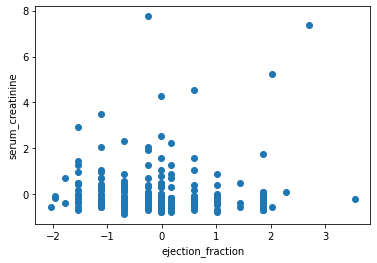
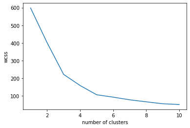
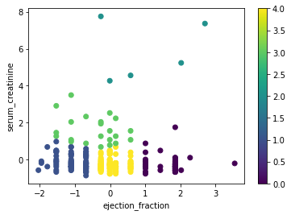
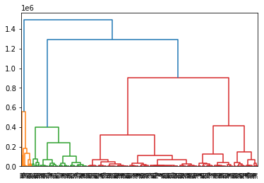
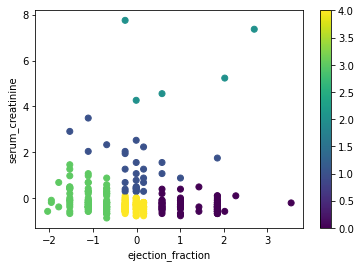
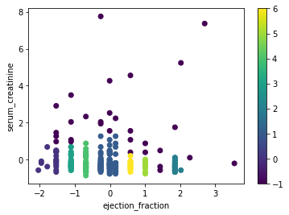

# Heart Failure Clustering with Python

This project focuses on clustering a dataset of patients who suffered from heart failure. The objective was to explore different clustering algorithms to categorize patients into groups based on their **ejection fraction** and **serum creatinine levels** and compare the results. The clustering methods used include **k-means**, **hierarchical clustering**, and **DBSCAN** (Density-Based Spatial Clustering of Applications with Noise).

## Table of Contents
- [Introduction](#introduction)
- [Preprocessing](#preprocessing)
- [K-Means](#k-means)
- [Hierarchical Clustering](#hierarchical-clustering)
- [DBSCAN](#dbscan)
- [Conclusion](#conclusion)

## Introduction

Heart failure occurs when the heart cannot pump sufficient blood to meet the body's needs. In the paper ["Machine learning can predict survival of patients with heart failure from serum creatinine and ejection fraction alone"](https://bmcmedinformdecismak.biomedcentral.com/articles/10.1186/s12911-020-1023-5), Davide Chicco and Giuseppe Jurman demonstrate that machine learning can predict a patient’s survival using these two attributes.

Inspired by their findings, I used the same dataset but approached it with clustering techniques. My goal was to group patients into risk categories, potentially aiding doctors in assessing patients' health risks more effectively.

The dataset, *heart_failure_clinical_records_dataset.csv*, was sourced from [UCI Machine Learning Repository](https://archive.ics.uci.edu/ml/datasets/Heart+failure+clinical+records) on **12/08/2022**.

## Preprocessing

I focused on two attributes: **ejection fraction** and **serum creatinine**, as suggested by Chicco and Jurman. To ensure comparability, I applied a **standard scaler** to normalize the data. Below is a scatter plot of the normalized data:

## K-Means

The first clustering method I used was **k-means**. This algorithm initializes `k` centroids and iteratively assigns points to the nearest centroid until convergence.  
To determine the optimal number of clusters, I used the **elbow method (WCSS)**. The graph below shows that 5 clusters provide a suitable balance between simplicity and accuracy.

After applying the k-means algorithm with 5 clusters, the resulting groups are visualized below:

## Hierarchical Clustering

Next, I explored **hierarchical clustering**, which builds a **dendrogram** to represent the distances between data points or clusters. From the dendrogram, I determined the optimal number of clusters to be either 4 or 5. I chose 5 for consistency with k-means.

The clustering results are visualized below. They closely resemble those from k-means but with slight variations in group sizes.

## DBSCAN

Finally, I applied **DBSCAN**, a density-based clustering algorithm. Instead of specifying the number of clusters, DBSCAN requires tuning parameters:
- `eps`: Maximum distance for a neighborhood.
- `min_samples`: Minimum points required for a core point.

After experimentation, I chose `eps=0.35` and `min_samples=5`. This resulted in **7 clusters**, with 30 unassigned points.

Unlike k-means and hierarchical clustering, DBSCAN revealed unique patterns, emphasizing its ability to identify clusters of varying densities.

## Conclusion

Using **ejection fraction** and **serum creatinine**, I explored clustering techniques on a heart failure dataset. The aim was to group patients in a way that could help doctors assess health risks.  
The three clustering methods—**k-means**, **hierarchical clustering**, and **DBSCAN**—revealed distinct insights:
- **K-means** and **hierarchical clustering** produced similar clusters.
- **DBSCAN** highlighted unique patterns and unassigned entries.

These insights could serve as a valuable tool for medical professionals to assess and prioritize patient care.

---
